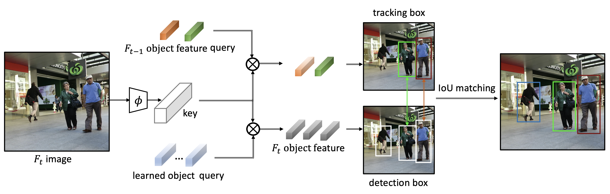

## TransTrack: Multiple Object Tracking with Transformer

[](https://opensource.org/licenses/MIT)




## Introduction
[TransTrack: Multiple Object Tracking with Transformer](https://arxiv.org/abs/2012.15460)

## Updates
- (22/02/2022) Multi-GPU testing is supported. 
- (29/10/2021) Automatic Mixed Precision(AMP) training is supported. 
- (28/04/2021) Higher performance is reported by training on mixture of CrowdHuman and MOT, instead of first CrowdHuman then MOT. 
- (28/04/2021) Higher performance is reported by pre-training both detection and tracking on CrowdHuman, instead of only detection. 
- (28/04/2021) Higher performance is reported by increasing the number of queries from 300 to 500. 
- (08/04/2021) Refactoring the code.  

## MOT challenge
Dataset | MOTA% | IDF1% | MOTP% | MT% | ML% |  FP | FN | IDS 
:---:|:---:|:---:|:---:|:---:|:---:|:---:|:---:|:---:
MOT17 | 74.5 | 63.9| 80.6 | 46.8 | 11.3 | 28323 | 112137 | 3663
MOT20 | 64.5 | 59.2 | 80.0 | 49.1 | 13.6 | 28566 | 151377 | 3565

## Validation set
Training data | Training time | MOTA% | FP% | FN% | IDs% | download
:---:|:---:|:---:|:---:|:---:|:---:|:---
[crowdhuman, mot17_half](track_exps/crowdhuman_mot_trainhalf.sh) |  ~45h + 1h  | 67.1 | 3.1  | 29.4 | 0.5 | [671mot17_crowdhuman_mot17.pth](https://drive.google.com/drive/folders/1DjPL8xWoXDASrxgsA3O06EspJRdUXFQ-?usp=sharing)
[crowdhuman](track_exps/crowdhuman_train.sh)                   |  ~45h       | 56.0 | 11.2 | 32.3 | 0.4 | [560mot17_crowdhuman.pth](https://drive.google.com/drive/folders/1DjPL8xWoXDASrxgsA3O06EspJRdUXFQ-?usp=sharing) 
[mot17_half](track_exps/mot_trainhalf.sh)                        |  9h        | 61.9 | 3.4  | 34.0   |0.7 |[619mot17_mot17.pth](https://drive.google.com/drive/folders/1DjPL8xWoXDASrxgsA3O06EspJRdUXFQ-?usp=sharing_)

Models are also available in [Baidu Drive](https://pan.baidu.com/s/1dcHuHUZ9y2s7LEmvtVHZZw) by code m4iv.

#### Notes
- We observe about 1 MOTA noise.
- If the resulting MOTA of your self-trained model is not desired, playing around with the --track_thresh sometimes gives a better performance.
- The default track_thresh is 0.4, except for 0.5 in crowdhuman.
- The training time is on 8 NVIDIA V100 GPUs with batchsize 16.
- We use the models pre-trained on imagenet.
- (crowdhuman, mot17_half) is first training on crowdhuman, then fine-tuning on mot17_half.


## Demo
  


## Installation
The codebases are built on top of [Deformable DETR](https://github.com/fundamentalvision/Deformable-DETR) and [CenterTrack](https://github.com/xingyizhou/CenterTrack).

#### Requirements
- Linux, CUDA>=9.2, GCC>=5.4
- Python>=3.7
- PyTorch ≥ 1.5 and [torchvision](https://github.com/pytorch/vision/) that matches the PyTorch installation.
  You can install them together at [pytorch.org](https://pytorch.org) to make sure of this
- OpenCV is optional and needed by demo and visualization


#### Steps
1. Install and build libs
```
git clone https://github.com/PeizeSun/TransTrack.git
cd TransTrack
cd models/ops
python setup.py build install
cd ../..
pip install -r requirements.txt
```

2. Prepare datasets and annotations
```
mkdir crowdhuman
cp -r /path_to_crowdhuman_dataset/CrowdHuman_train crowdhuman/CrowdHuman_train
cp -r /path_to_crowdhuman_dataset/CrowdHuman_val crowdhuman/CrowdHuman_val
mkdir mot
cp -r /path_to_mot_dataset/train mot/train
cp -r /path_to_mot_dataset/test mot/test
```
CrowdHuman dataset is available in [CrowdHuman](https://www.crowdhuman.org/). 
```
python3 track_tools/convert_crowdhuman_to_coco.py
```
MOT dataset is available in [MOT](https://motchallenge.net/).
```
python3 track_tools/convert_mot_to_coco.py
```

3. Pre-train on crowdhuman
```
sh track_exps/crowdhuman_train.sh
python3 track_tools/crowdhuman_model_to_mot.py
```
The pre-trained model is available [crowdhuman_final.pth](https://drive.google.com/drive/folders/1DjPL8xWoXDASrxgsA3O06EspJRdUXFQ-?usp=sharing).

4. Train TransTrack
```
sh track_exps/crowdhuman_mot_trainhalf.sh
```

5. Evaluate TransTrack
```
sh track_exps/mot_val.sh
sh track_exps/mota.sh
```

6. Visualize TransTrack
```
python3 track_tools/txt2video.py
```


## Test set
Pre-training data | Fine-tuning data | Training time | MOTA% | FP | FN | IDs
:---:|:---:|:---:|:---:|:---:|:---:|:---:
crowdhuman | mot17 | ~40h + 2h | 68.4 | 22137  | 152064  | 3942  
crowdhuman | crowdhuman + mot17 | ~40h + 6h | 74.5 | 28323 | 112137 | 3663 

#### Notes
- Performance on test set is evaluated by [MOT challenge](https://motchallenge.net/).
- (crowdhuman + mot17) is training on mixture of crowdhuman and mot17.
- We won't release trained models for test test. Running as in Steps could reproduce them. 
 
#### Steps
1. Train TransTrack
```
sh track_exps/crowdhuman_mot_train.sh
```

or

1. Mix crowdhuman and mot17
```
mkdir -p mix/annotations
cp mot/annotations/val_half.json mix/annotations/val_half.json
cp mot/annotations/test.json mix/annotations/test.json
cd mix
ln -s ../mot/train mot_train
ln -s ../crowdhuman/CrowdHuman_train crowdhuman_train
cd ..
python3 track_tools/mix_data.py
```
2. Train TransTrack
```
sh track_exps/crowdhuman_plus_mot_train.sh
```


## License

TransTrack is released under MIT License.


## Citing

If you use TransTrack in your research or wish to refer to the baseline results published here, please use the following BibTeX entries:

```BibTeX

@article{transtrack,
  title   =  {TransTrack: Multiple-Object Tracking with Transformer},
  author  =  {Peize Sun and Jinkun Cao and Yi Jiang and Rufeng Zhang and Enze Xie and Zehuan Yuan and Changhu Wang and Ping Luo},
  journal =  {arXiv preprint arXiv: 2012.15460},
  year    =  {2020}
}

```
